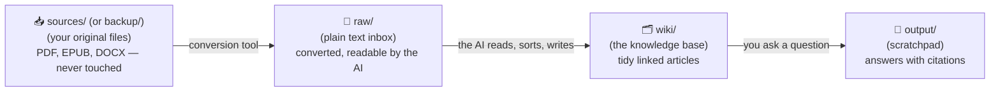
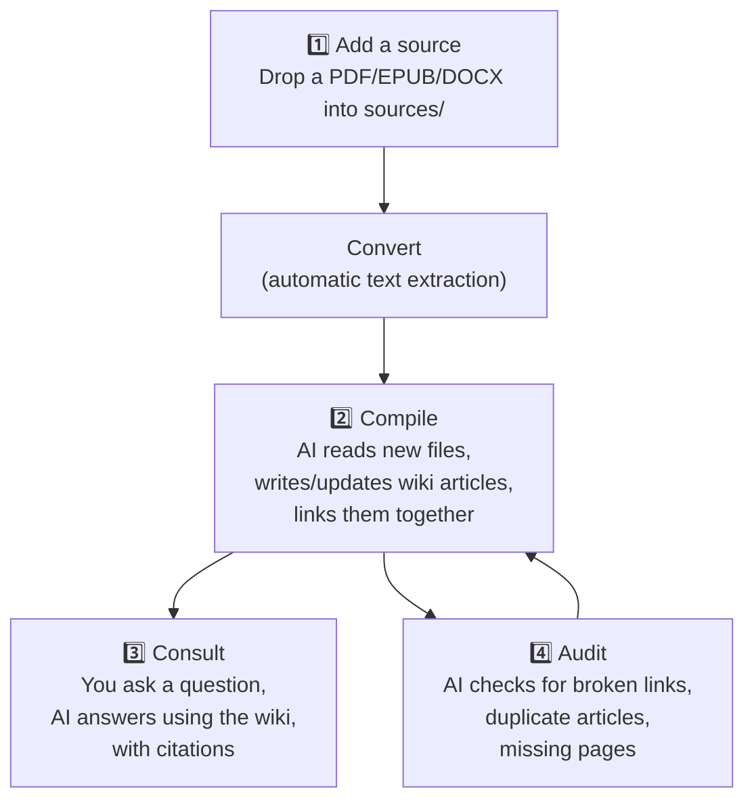

# TUTORIAL — Your "second brain" (an LLM Wiki), explained simply

*A plain-language guide for non-technical readers. It explains, step by step, what
Wiki-Forge is, why it works, and how to use it day to day. No programming knowledge
required — you only ever edit one small settings file and drop files into a folder.*

---

## 0. The Problem This Project Solves

Imagine you're writing a thesis, running a book club, or researching a topic you care about. Over months you collect dozens of PDFs, e-books, articles, and notes. Two things usually go wrong:

1. **You forget what you've read.** Six months later you remember "there was a great passage about X" but not which of your 40 PDFs it was in.
2. **Asking an AI chatbot to help doesn't scale.** If you paste a whole library at an AI every time you have a question, it's slow, expensive, and the AI has to re-read everything from scratch each time — like hiring a new intern every morning who has never seen your files before.

Wiki-Forge solves this by giving the AI a **permanent memory that improves over time**, instead of a blank slate every time you ask a question.

> **Analogy:** Instead of dumping a box of loose papers on someone's desk every time you have a question, you hire a librarian once. The librarian reads every new book you bring in, writes a tidy summary card for it, files it under the right subject, and cross-references it with everything else in the library. From then on, when you ask a question, the librarian doesn't re-read the whole library — they walk straight to the right shelf.

---

## 1. The Core Idea & Three-Folder Structure

The idea comes from Andrej Karpathy's **LLM Wiki** pattern (see `docs/KARPATHY_LLM_WIKI.md`). Instead of searching raw documents every time (classic RAG), the LLM **incrementally builds a persistent, interlinked wiki** of Markdown files that sits between you and your sources.

Everything in Wiki-Forge revolves around three main folders:

```
project/
├── sources/  (named backup/)  Your ORIGINAL files (PDF, EPUB) — untouched, keep safe
├── raw/                        The same files turned into plain text (Markdown)
├── wiki/                       The knowledge, organized and linked (written by the AI)
└── output/                     Temporary answers to your questions
```



| Folder | Role | Description |
|--------|------|-------------|
| **`sources/`** (named `backup/`) | The locked archive | Your original files (PDF, EPUB, DOCX). Untouched and safe. |
| **`raw/`** | The "in-tray" / inbox | Converted plain text (Markdown) versions of your files ready to be processed. |
| **`wiki/`** | The "whiteboard" / library | The heart of the second brain. Tidy articles written by the AI with `[[wikilinks]]`. |
| **`output/`** | The "scratchpad" | Ephemeral answers and reports. Emptying it loses no persistent knowledge. |

---

## 2. Important Note on `backup/`, `raw/`, and `output/` Folders

If you have just cloned this repository, you might notice that `backup/` (or `sources/`), `raw/`, and `output/` **do not appear in Git**:

- **These folders are intentionally listed in `.gitignore`.** They are local working directories meant to hold your personal documents, converted text files, and temporary outputs.
- **They are created and populated automatically** on your computer when you run your first conversion command (e.g. `bash run_convert.sh`, `python conv2md.py`, or the Wizard).
- **This is expected behavior, not an error.** Keeping working directories out of Git ensures that your private documents, books, and notes are never accidentally committed or uploaded to public repositories.

---

## 3. The AI's "Manual": `AGENT.md`

The agent reads `docs/AGENT.md` (symlinked in the root as `AGENT.md`) at every startup to know how to manage the knowledge base. It is **prose, not code** — plain instructions in English:

1. **The AI's role**: "librarian" — ingest raw material, maintain the wiki, answer with traceable syntheses.
2. **The rules of the folders** (`sources/` / `raw/` / `wiki/` / `output/`).
3. **The wiki structure**: a master `index.md`, then one folder per theme (`wiki/<topic>/`) with its own `index.md` and many articles conforming to the Open Knowledge Format (OKF v0.2).
4. **The agent workflows**: Consult, Compile, Audit, Trace, Reindex, and more.

> `AGENT.md` (located in `docs/AGENT.md` and symlinked at `AGENT.md` in root) is just an instruction sheet written in clear English. Every time you open the agent, it reads it and knows what to do.

---

## 4. Everyday Workflow (Step by Step)



### Step 1 — Get documents into `raw/`
1. Put original PDFs, EPUBs, or DOCX files into `sources/` (or `backup/`).
2. Run `bash run_convert.sh` (or `python conv2md.py`).
3. Converted Markdown files appear in `raw/`, ready to be processed.

#### Alternative: Import from Google NotebookLM (Importazione da NotebookLM)
If you study documents or videos on Google NotebookLM and generate Study Guides, FAQs, or Briefings:
1. Export or copy the Markdown generated in NotebookLM to a local file (e.g. `notebook_export.md`).
2. Run the import tool:
   ```bash
   python scripts/notebooklm_import.py notebook_export.md --source "Research Topic X"
   ```
3. The file will be cleaned, annotated with OKF v0.2 YAML frontmatter, and placed in `raw/notebook_export_NOTEBOOKLM.md`.
4. Run `/compile` in your agent to integrate the knowledge directly into `wiki/`.

### Step 2 — Compile (Build the wiki)
When you tell the agent `compile` (or `/compile`):
1. Runs conversion for any newly added documents in `sources/`.
2. Reads uncompiled files in `raw/`.
3. Classifies them by theme, writes or updates structured articles in `wiki/`.
4. Links articles together with `[[wikilinks]]`.
5. Renames processed raw files with a `_COMPILED` suffix (e.g., `paper_COMPILED.md`) so they are not reprocessed.

### Step 3 — Consult (Ask questions)
When you ask a question or run `consult "..."` (or `/consult`):
1. The agent inspects `wiki/index.md` and thematic indexes.
2. Reads only the relevant clean wiki articles (saving time and tokens).
3. Answers by synthesizing information and citing sources with `[[wikilinks]]`.

### Step 4 — Audit (Maintain health)
Running `audit` (or `/audit`):
1. Checks for broken `[[wikilinks]]`.
2. Detects duplicate articles to merge.
3. Verifies index synchronization and OKF v0.2 frontmatter schema.

---

## 5. The Bibliography Registry: `docs/SOURCES.md`

Wiki-Forge maintains a source registry at `docs/SOURCES.md`. It lists every ingested source, ordered by author and topic, linking the `raw/` converted file to its compiled `wiki/` article. You can regenerate or update it at any time using the `sources` (or `sources regenerate`) command.

---

## 6. The Web UI — Your Second Brain in the Browser

Wiki-Forge includes an interactive Web UI (Vite + TypeScript) so you can view, edit, search, and navigate your wiki without needing Obsidian or external tools.

```
+---------------------+-------------------------------------+---------------------+---------------------+
|    Header · Editor | Graph View | Split View ·  💬 OpenCode Chat                    |                     |
+---------------------+-------------------------------------+---------------------+---------------------+
|  Vault Explorer     |        Markdown Editor              |   Context Panel     |   Chat Drawer       |
|  · file toolbar     |  · clean rendered preview           |   · backlinks       |   · shortcuts       |
|    📁+ 📄+ 📤 ✏️ 🗑️ |  · CodeMirror 6 edit mode            |   · outbound links  |     /consult … /x  |
|  · file tree, drag&drop | · 💾 Save & Close / ✖ Cancel   |   · note tags       |   · 🪄 wizard sel.  |
|  · search (Ctrl+K)  |  · clickable [[wikilinks]]           |                     |   · streaming answers|
|  · tag cloud filter |                                     |                     |   · 📌 Attach to Wiki|
+---------------------+-------------------------------------+---------------------+---------------------+
|  Graph view · controls (zoom, node search, min-connections, reset) — click a node to open it |
+-----------------------------------------------------------------------------------------------+
|  Footer · status bar (vault & engine state)                                                     |
+-----------------------------------------------------------------------------------------------+
```

### Features
- **Vault Explorer**: Collapsible file tree of `wiki/`, instant search (**Ctrl+K**), file operations toolbar (`📁+`, `📄+`, `📤`, `✏️`, `🗑️`), and tag cloud filter.
- **Markdown Editor**: CodeMirror 6 editor with syntax highlighting, `[[wikilink]]` completion, and keyboard shortcuts (`Ctrl/Cmd+S`, `Ctrl/Cmd+B`, `Ctrl/Cmd+I`).
- **Context Panel**: Shows backlinks, outbound links, and tags for the active note.
- **Graph View**: Interactive force-directed link graph showing connections between notes.
- **Script Control Panel (🛠️ Tools)**: Graphical interface accessible from the header to configure and execute all 15 Python CLI scripts with real-time log output console streaming.
- **Chat Drawer**: Integrated agent assistant with stream responses, one-click `/` command shortcuts, scenario wizard selector, and **📌 Attach to Wiki** button.

### How to Launch
```bash
npm install        # First time only
npm run dev        # Open http://localhost:5173
```
Or via Docker:
```bash
make ui-docker     # Open http://localhost:5173
```

---

## 7. Multi-Project Management & GUI Config Manager

Wiki-Forge supports managing multiple wiki projects simultaneously without modifying source code.

### Structure of `projects/`
Multiple projects live in the `projects/` directory at the root level. Each project acts as an isolated knowledge base vault with its own settings and folders:

```
projects/
├── thesis/
│   ├── config.toml
│   ├── sources/
│   ├── raw/
│   ├── wiki/
│   ├── output/
│   └── notes/
└── business-kb/
    ├── config.toml
    └── ...
```

A central `projects.json` file in the root directory registers all available projects:
```json
[
  { "id": "default", "name": "Default Wiki", "path": "." },
  { "id": "thesis", "name": "Thesis Wiki", "path": "projects/thesis" }
]
```

### Project Switcher & GUI Config Manager in Web UI
- **Project Switcher**: The header includes a **Project:** dropdown allowing you to switch between active projects instantly. The active project selection is persisted in `localStorage` (`wiki-forge:active-project`).
- **GUI Config Manager**: Click the **⚙️ Config** button in the header to open a visual tabbed modal interface:
  - **Generale**: Edit project `name`, `title`, `language`, and `context`.
  - **Percorsi**: Configure custom directory paths for `sources`, `raw`, `wiki`, `output`, and `notes`.
  - **LLM & Agent**: Configure `provider` (`opencode`, `anthropic`, `openai_compatible`, `ollama`), `model`, `api_key_env`, and `timeout_seconds`.
  - **OKF & Tag**: Manage Open Knowledge Format version and `type_vocabulary`.
  - **Project Actions**: Create a new project directly from the interface or delete secondary projects.

All configuration updates are written to `config.toml` safely formatted using `smol-toml`.

---

## 8. The Scenario Wizard — Domain Presets

A *scenario* is a ready-made setup for specific project types. Presets live in `config/scenarios.toml`:

| Scenario | ID | Use Case |
|----------|----|----------|
| Academic / Thesis | `academic` | Literature review, PDF ingestion, theory extraction |
| Business KB | `business` | SOPs, meeting notes, company knowledge base, FAQs |
| Competitive Research | `research` | Article/report analysis, source tracing, dossiers |
| Creative Fiction | `creative` | Worldbuilding, character/location stubs |
| Existing Wiki | `existing` | Health audit, navigation, summaries for existing wikis |

Run via CLI:
```bash
python scripts/wizard.py            # Interactive menu
python scripts/wizard.py --preset academic  # Direct preset launch
```
Or in Web UI Chat / Agent CLI using `wizard` or `/wizard [scenario]`.

---

## 9. Command Cheat Sheet

### Daily Commands
| Command | Purpose | Example |
|---------|---------|---------|
| `compile` / `/compile` | Process new raw files into the wiki | `compile` |
| `ingest <file>` / `/ingest` | Process a single raw file | `ingest raw/paper.md` |
| `convert-only` / `/convert-only` | Convert sources without compiling | `convert-only` |
| `recompile <file>` / `/recompile` | Force re-processing of a compiled raw file | `recompile raw/paper_COMPILED.md` |
| `consult "..."` / `/consult` | Query the wiki for answers with citations | `consult "What are LLM agents?"` |
| `study-guide <topic>` / `/study-guide` | Generate study guide in `output/` | `study-guide ai-tools` |
| `quiz <topic> [n]` / `/quiz` | Generate interactive quiz in `output/` | `quiz ai-tools 5` |
| `mindmap <art>` / `/mindmap` | Generate concept mind map in `output/` | `mindmap ai-tools/claude-code` |
| `audio-overview <target>` / `/audio-overview` | Generate 2-speaker podcast dialogue script | `audio-overview ai-tools` |
| `deep-research <q>` / `/deep-research` | Multi-source synthesis research report | `deep-research "agent architectures"` |
| `note <text>` / `/note` | Record quick scratchpad note in `notes/` | `note "check Karpathy paper on LLM OS"` |
| `promote-note <id>` / `/promote-note` | Promote scratchpad note to wiki article | `promote-note note-1 ai-tools` |
| `maturity [path]` / `/maturity` | Calculate and update note maturity scores | `maturity wiki/` |
| `thesis-chapter` / `/thesis-chapter` | Compile thesis chapters and mature notes | `thesis-chapter 50` |
| `search <term>` / `/search` | Search concepts across the wiki | `search "LLM-OS"` |
| `backlinks [note]` / `/backlinks` | View incoming links to a note | `backlinks ai-tools/claude-code` |
| `related [note]` / `/related` | View related notes | `related ai-tools/claude-code` |
| `trace "claim"` / `/trace` | Passage-level source grounding verification | `trace "LLMs as OS"` |
| `help` / `/help` | Show command reference | `help` |

### Weekly Maintenance Commands
| Command | Purpose |
|---------|---------|
| `audit` / `/audit` | General wiki health check |
| `reindex` / `/reindex` | Rebuild master and thematic indexes |
| `prune` / `/prune` | Remove empty or orphan notes |
| `lint-frontmatter` / `/lint-frontmatter` | Validate frontmatter against OKF v0.2 |
| `stats` / `/stats` | View wiki growth and link metrics |

### Curation & As-Needed Commands
| Command | Purpose |
|---------|---------|
| `new-article <name>` / `/new-article` | Create new article from template |
| `merge <a> <b>` / `/merge` | Merge duplicate articles |
| `split <art> <heading>` / `/split` | Split long article into sub-articles |
| `stub <concept>` / `/stub` | Create placeholder stub |
| `retag <art> [+tag]` / `/retag` | Add or update article tags |
| `sources` / `sources regenerate` | Rebuild bibliography registry (`docs/SOURCES.md`) |
| `tag-suggest [file]` / `/tag-suggest` | Suggest tags from controlled vocabulary |
| `export json` / `/export` | Export wiki structure |
| `diff <art>` / `/diff` | Show git diff of an article |
| `template show` / `/template` | Display article template |
| `wizard [scenario]` / `/wizard` | Launch scenario-driven wizard |

---

## 10. Troubleshooting

### "The agent says it can't find raw files"
- Check that `config.toml` exists and `paths.raw` points to `raw`.
- Run `bash run_convert.sh` or `python conv2md.py` to convert sources.

### "Links are broken after renaming an article"
1. Run `audit` to detect broken wikilinks.
2. Run `reindex` to update indexes.

### "I have two articles about the same topic"
- Run `audit` to find duplicates.
- Run `merge <article-1> <article-2>` to combine them.

---

## 11. Keeping Your Wiki Healthy

- **Monthly**: Run `audit` to fix broken links, run `sources regenerate` to keep `docs/SOURCES.md` updated, and run `stats` to review wiki growth.
- **Quarterly**: Run `audit` for duplicate detection, check `wiki/index.md` organization, and backup with `export json`.
- **Yearly**: Archive old `output/` files and update `config.toml` if your project scope evolves.
