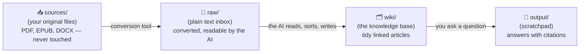
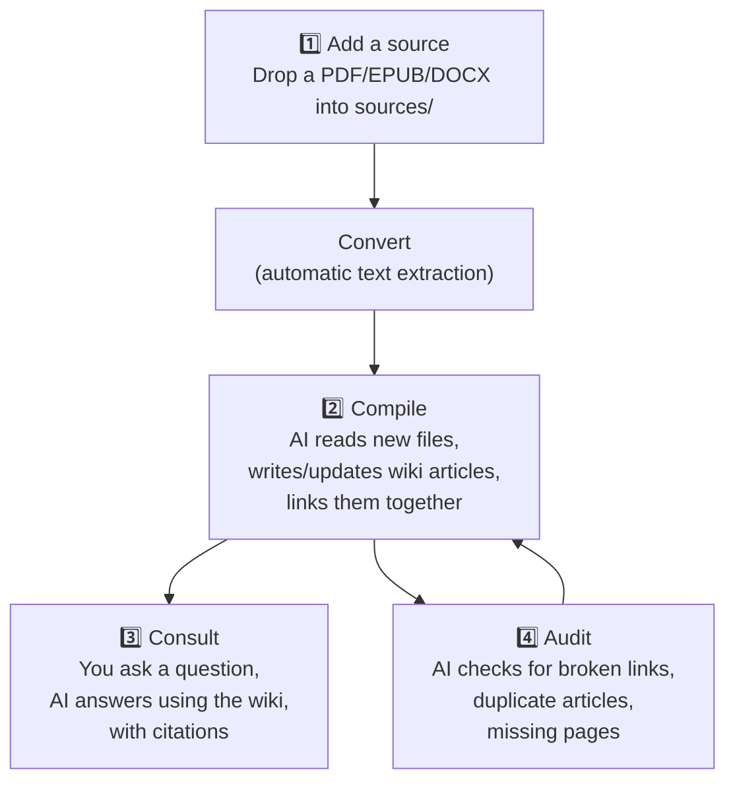
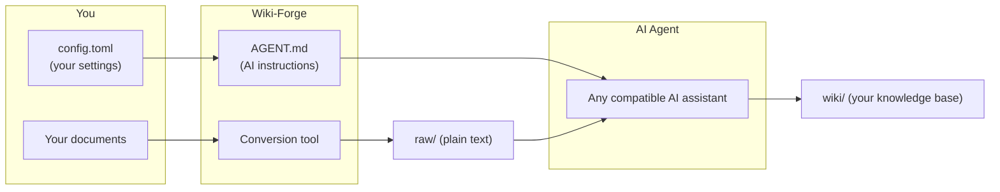

# Wiki-Forge, Explained Simply
### How an AI can build and maintain your own personal "second brain"

*A plain-language guide for non-technical readers, based on the open-source project [alby69/wiki-forge](https://github.com/alby69/wiki-forge).*

---

## 1. The problem this project solves

Imagine you're writing a thesis, running a book club, or researching a topic you care about. Over months you collect dozens of PDFs, e-books, articles, and notes. Two things usually go wrong:

1. **You forget what you've read.** Six months later you remember "there was a great passage about X" but not which of your 40 PDFs it was in.
2. **Asking an AI chatbot to help doesn't scale.** If you paste a whole library at an AI every time you have a question, it's slow, expensive, and the AI has to re-read everything from scratch each time — like hiring a new intern every morning who has never seen your files before.

Wiki-Forge solves this by giving the AI a **permanent memory that improves over time**, instead of a blank slate every time you ask a question.

> **Analogy:** Instead of dumping a box of loose papers on someone's desk every time you have a question, you hire a librarian once. The librarian reads every new book you bring in, writes a tidy summary card for it, files it under the right subject, and cross-references it with everything else in the library. From then on, when you ask a question, the librarian doesn't re-read the whole library — they walk straight to the right shelf.

---

## 2. The core idea: a wiki, not a chat history

Wiki-Forge is built around an idea popularized by AI researcher **Andrej Karpathy**, called the "LLM Wiki" pattern. The insight is simple but powerful:

- A chatbot's memory of your documents normally resets every conversation.
- Instead, let the AI **write things down permanently**, in the same interlinked style as **Wikipedia**: short articles, one per topic, cross-linked to related articles.
- The next time you ask a question, the AI reads the *tidy, curated wiki* — not the messy original documents.

This turns a one-off conversation into a **growing, structured knowledge base** that keeps getting more useful the more you use it.

---

## 3. The mental model: three trays on a desk

Everything in Wiki-Forge revolves around three folders, which you can picture as three trays on a librarian's desk:



| Tray | Real-world equivalent | What lives here |
|---|---|---|
| **`sources/`** | The locked archive room | Your original files — books, PDFs, articles. Never modified, always safe. |
| **`raw/`** | The librarian's in-tray | The same documents, automatically converted into plain, readable text. |
| **`wiki/`** | The library shelves | Short, clean articles the AI writes, one per topic, linked to each other. |
| **`output/`** | A notepad by the phone | Temporary answers to your questions. You can throw these away — no knowledge is lost. |

The important design choice: **your original files are never edited or deleted.** The AI only ever adds new files (converted copies and wiki articles); it never touches the sources tray.

---

## 4. The AI's "job manual"

Every librarian needs training. In Wiki-Forge, that training is a single plain-English document called **`AGENT.md`**. There's no code in it — it's written like an employee handbook, and any AI assistant (Claude, ChatGPT-style agents, Gemini, etc.) can read and follow it.

`AGENT.md` tells the AI:

- **Its role**: act like a librarian — read new material, keep the wiki organized, always answer with traceable sources.
- **The house rules** for the three trays described above.
- **The filing format**: every wiki article follows the same template (title, short intro, summary, sections, "related articles," and a link back to its original source).
- **The three things you're allowed to ask it to do**: *Compile*, *Consult*, and *Audit* (explained below).

Because the manual is just plain English text, **you can edit it yourself** — no programming needed — to change how the AI behaves (for example, changing how articles are named).

---

## 5. The four everyday actions

Once set up, your day-to-day interaction with Wiki-Forge boils down to four simple actions. Think of them as four buttons you can press at any time.



### ① Add a source
You drop a file — a PDF of a book, an article, your own notes — into the `sources/` folder. That's the only manual step.

### ② Compile — "turn raw material into knowledge"
You tell the AI: *"compile."* It then, step by step:
1. Converts any new files into plain text.
2. Reads every file that hasn't been processed yet.
3. Figures out what topic(s) each file belongs to.
4. Writes or updates short wiki articles about those topics.
5. Cross-links related articles (the way Wikipedia links words to other pages).
6. Marks the original file as "done" by renaming it (adding `_COMPILED` to the filename), so it's never processed twice.

### ③ Consult — "ask a question"
You type a question, e.g. *"What did the author say about the future of work?"* The AI:
1. First skims the wiki's table of contents (an `index.md` file) to see what topics exist.
2. Opens only the relevant articles — not your entire library.
3. Writes an answer, citing the specific wiki articles it used.

This is the payoff of all the earlier organizing work: **answers are fast and accurate because the AI is reading a few clean, curated pages instead of hundreds of pages of raw text.**

### ④ Audit — "spring cleaning"
Every so often, you ask the AI to *"audit"* the wiki. It checks for:
- Links that point to articles that don't exist.
- Duplicate articles about the same topic that should be merged.
- Indexes that are out of date.
- Topics that are mentioned often but still have no dedicated article.

---

## 6. A worked example

Let's say you're building a knowledge base for a university thesis on "AI and the future of work," and you've collected three PDFs: two books and one research paper.

**Step 1 — You drop the three PDFs into `sources/`.**

**Step 2 — You say "compile."** The AI converts the PDFs to text, reads them, and creates something like this:

```
wiki/
├── index.md                     ← the "front page" of your knowledge base
├── economics/
│   ├── index.md
│   ├── automation-and-jobs.md
│   └── universal-basic-income.md
└── technology/
    ├── index.md
    └── large-language-models.md
```

Each article, for example `automation-and-jobs.md`, looks roughly like a short Wikipedia page:

```markdown
---
tags: [economics, automation]
sources: [raw/smith-future-of-work_COMPILED.md]
---

# Automation and Jobs

A short two-to-four-line introduction explaining what this article covers.

## Summary
Key idea distilled in a few sentences.

## Details
Longer discussion, organized under sub-headings.

## Related
- [[universal-basic-income]]
- [[large-language-models]]

## Sources
- Smith, J. — *The Future of Work* (see raw/smith-future-of-work_COMPILED.md)
```

**Step 3 — You ask a question**, e.g. *"How might automation affect income inequality?"* The AI reads `wiki/index.md`, then `economics/index.md`, then opens just the two or three relevant articles, and gives you an answer that references `[[automation-and-jobs]]` and `[[universal-basic-income]]` — so you can click through and verify exactly where each claim comes from.

**Step 4 — Months later**, you add ten more PDFs. You just repeat "compile." The wiki grows incrementally; nothing has to be redone from scratch.

---

## 7. Why this approach is better than "just asking a chatbot"

This design is a deliberate alternative to the common approach known as **RAG (Retrieval-Augmented Generation)**, where an AI searches through raw documents every single time you ask something. The chart below shows the practical trade-off:

| | Ask-the-raw-documents approach | Wiki-Forge approach |
|---|---|---|
| First question about a topic | Slow — AI reads raw files each time | Slower once (during "compile"), fast forever after |
| Repeated questions on same topic | Repeats the same reading work every time | Reuses the already-written article instantly |
| Traceability | Hard to know exactly where an answer came from | Every article cites its exact source file |
| Growth over time | Gets slower/costlier as your library grows | Indexes keep the AI fast even as the wiki grows |
| What you keep at the end | Nothing reusable — just chat logs | A permanent, human-readable knowledge base you can browse without any AI at all |

That last row matters most: **even if you stopped using AI tomorrow, the `wiki/` folder is still useful.** It's just plain Markdown text files, the same format used by note-taking apps like Obsidian, so you (or anyone) can open, read, and navigate them like a personal Wikipedia — with or without the AI.

---

## 8. How the pieces fit together technically (in plain terms)

You don't need to understand code to use Wiki-Forge, but here's what's happening under the hood, described without jargon:

- **One settings file (`config.toml`)** tells the whole system three things: what to call your project, what it's about, and where your folders are. Change this file once and the entire template can be reused for a completely different subject (a business archive, a book club, a personal journal…).
- **A small conversion tool** (`conv2md.py`) acts like a universal translator: it takes PDFs, e-books (EPUB), and Word documents (DOCX) and turns them into plain text the AI can read easily.
- **A "librarian's manual" (`AGENT.md`)** — plain English instructions — tells whichever AI assistant you use (there are several compatible ones) exactly how to behave. This makes the system **AI-agnostic**: it isn't locked to one specific AI provider.
- **Everything is stored as plain text files** in ordinary folders — no databases, no proprietary formats, nothing you can't open in a basic text editor. This makes the whole system easy to back up (for example, with the free version-control tool Git) and impossible to get "locked into."



---

## 9. Who is this useful for?

- **Students & researchers** — building a literature review or thesis knowledge base that grows over a semester or years.
- **Book clubs or reading groups** — accumulating notes and cross-references across many books.
- **Small businesses** — turning scattered manuals, contracts, and meeting notes into a searchable internal wiki.
- **Anyone with a personal archive** — journaling, hobby research, family history — who wants an AI-assisted, always-available "second brain" that stays private and lives entirely on their own computer.

---

## 10. Key takeaways

- **Wiki-Forge is a template**, not a finished app — a folder structure plus a set of plain-English instructions that any capable AI assistant can follow.
- It replaces "ask the AI to reread everything every time" with **"the AI writes it down once, then reuses what it wrote."**
- Your original files are **never modified**; the AI only adds new, organized copies.
- The output — the `wiki/` folder — is **plain text you own forever**, readable with or without AI, and easy to back up.
- Everyday use comes down to four simple actions: **add a source, compile, consult, audit.**
- Because the "rules" live in one plain-English file (`AGENT.md`) and one settings file (`config.toml`), the whole system can be **reused for any subject** without touching any code.

---

*This document is an independent, plain-language summary intended for non-technical readers. For the authoritative and most up-to-date details, always refer to the original repository: [github.com/alby69/wiki-forge](https://github.com/alby69/wiki-forge).*
